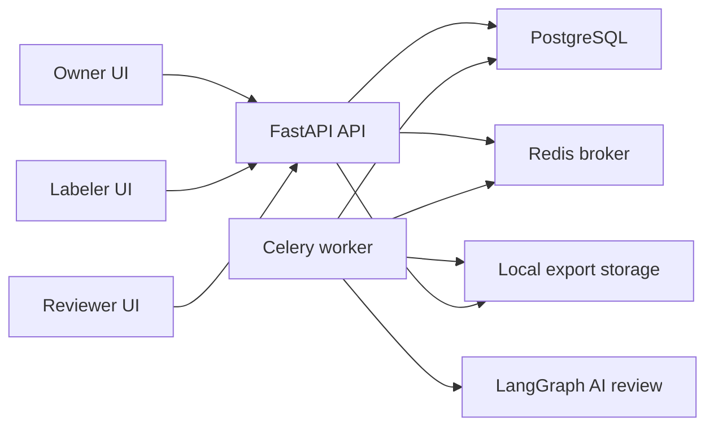

# LabelHub Architecture

## Runtime Shape

## Module Boundaries

- `backend/app/api/routes`: HTTP route layer. It validates role access and delegates business behavior to services.
- `backend/app/services/workflow.py`: central workflow transition authority for task and submission status changes.
- `backend/app/services/templates.py`: template draft/publish/versioning plus backend answer validation.
- `backend/app/services/submissions.py`: claim, draft, submit, approve, return, and attempt-history behavior.
- `backend/app/services/ai_review.py`: orchestrates LangGraph review, structured output validation, persistence, and workflow transitions.
- `backend/app/services/exports.py`: export job creation, record loading, and JSON/JSONL/CSV/XLSX writers.
- `frontend/src/features`: role-oriented UI modules for owner, labeler, reviewer, templates, schema rendering, and exports.

## Data Flow

1. Owner creates a task, imports task items, saves a template draft, publishes the template, configures review criteria, and publishes the task.
2. Labeler claims a published task item. The backend creates an assignment and draft submission tied to the currently published immutable template snapshot.
3. Labeler submits answers. Backend validates answers against the stored template snapshot and persists a submission attempt.
4. AI review runs as an auditable system actor. Structured output is persisted in `ai_reviews`; workflow transitions still go through `WorkflowService`.
5. Reviewer reads queue/detail contracts with AI metadata, human review records, audit logs, frozen template snapshot, and previous attempts.
6. Reviewer approves or returns. Human review records and audit logs are persisted.
7. Owner creates an export job. Worker writes approved/exportable records to local storage, and the API serves the file download.

## Persistence

PostgreSQL is the default runtime database. SQLite is acceptable only for local smoke testing. Alembic migrations currently include:

- `20260523_0001_core_domain.py`
- `20260524_0002_submission_attempt_history.py`

## AI Review

Live AI review requires server-side provider configuration:

- `LLM_PROVIDER`
- `LLM_MODEL`
- `LLM_BASE_URL`
- `LLM_API_KEY`
- `LLM_TEMPERATURE`

If credentials are missing, the AI review service creates an auditable failed review and routes the submission to human review instead of making a live provider call.
